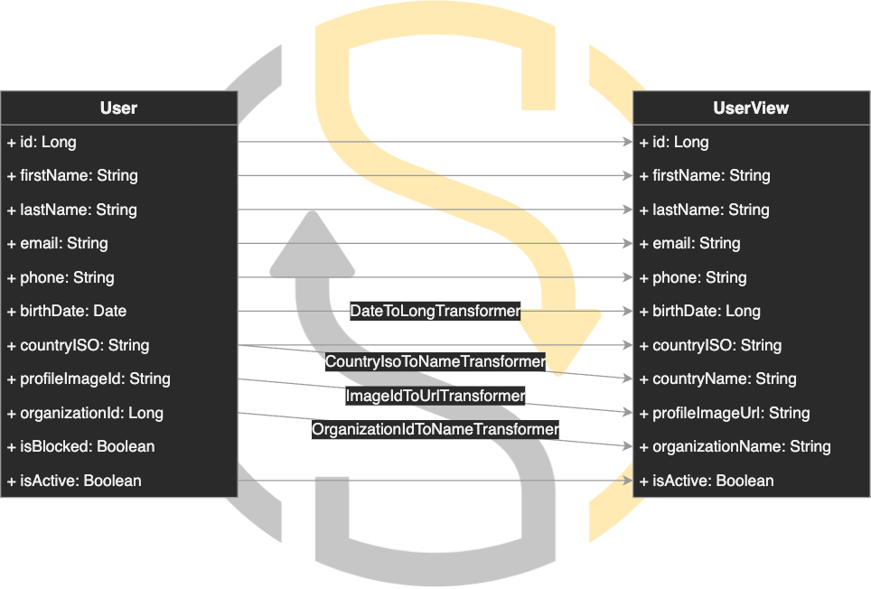

<br/>

<p align="center">
  <a href="https://github.com/chakra-ui/chakra-ui">
    
  </a>
</p>
<h1 align="center">ShapeShift️</h1>

<div align="center">
A Kotlin/Java library for intelligent object mapping and conversion between objects.
<br/>
<br/>

[](https://kotlin.link/)

[](https://circleci.com/gh/krud-dev/shapeshift/tree/master)
[](https://codecov.io/gh/krud-dev/shapeshift)
[](https://github.com/krud-dev/shapeshift/blob/master/LICENSE)
[](https://github.com/krud-dev/shapeshift/issues)

</div>

- [Overview](#overview)
- [Documentation](#documentation)
- [Installation](#installation)
  - [Requirements](#requirements)
  - [Maven](#maven)
  - [Gradle](#gradle)
    - [Groovy DSL](#groovy-dsl)
    - [Kotlin DSL](#kotlin-dsl)
- [Quickstart](#quickstart)
  - [Kotlin](#kotlin)
    - [Kotlin DSL](#kotlin-dsl-1)
    - [Kotlin Annotation](#kotlin-annotation)
  - [Java](#java)
    - [Java Builder](#java-builder)
    - [Java Annotation](#java-annotation)
- [Examples](#examples)
- [Contributing](#contributing)
- [License](#license)

## Overview

ShapeShift is a Kotlin first object mapping library. We have built ShapeShift because we wanted a simple to use, minimal boiler plate mapping engine, that is also flexible and supports the most advanced use cases.

Built with Kotlin in mind, ShapeShift was designed around its ecosystem and best practices. The library has 2 main tools for mapping:

* Annotations - Fully featured annotation based mapping, just add annotations to your objects and ShapeShift handles the rest. Including using custom field transformers, conditional mapping, advanced object decoration and much more. ([Kotlin Example](#kotlin-annotation), [Java Example](#java-annotation))
* Kotlin DSL - A Kotlin DSL allowing you to define the relations between objects. This allows you to map objects you can't change (or don't want to), like objects from 3rd party libraries. Additionally you can define inline transformations, conditions and decorations, enabling deep customization and very advanced mapping. ([Kotlin Example](#kotlin-dsl-1))
* Java Builder - The equivalent Java API for the Kotlin DSL. Allowing you to define the relations between objects without modifying their code, and map objects you can't change (or don't want to). ([Java Example](#java-builder))

ShapeShift main features:

* Auto Mapping
* Custom field transformers
* Default transformers
* Deep mapping
* Multiple mapping targets
* Conditional mapping
* Mapping decorators
* Seamless spring integration
* Native Android support

<p align="center">
  
</p>

## Documentation

To learn how to get started with **ShapeShift**, visit the official documentation website. You'll find in-depth documentation, tips and guides to help you get up and running.

<p>
  <a href="https://shapeshift.krud.dev/">
    
  </a>
</p>

## Installation
### Requirements

* Minimum supported Kotlin version: 1.6.X
* Minimum supported Java version: 1.8

### Maven
```xml
<dependency>
  <groupId>dev.krud</groupId>
  <artifactId>shapeshift</artifactId>
  <version>0.6.0</version>
</dependency>
```

### Gradle
#### Groovy DSL
```groovy
implementation 'dev.krud:shapeshift:0.6.0'
```
#### Kotlin DSL
```kotlin
implementation("dev.krud:shapeshift:0.6.0")
```

## Quickstart

### Kotlin 

#### Kotlin DSL
```kotlin
// Source Class
data class Source(
    val firstName: String,
    val lastName: String,
    val birthDate: LocalDate
)

// Target Class
data class Target(
    var firstName: String = "",
    var lastName: String = "",
    var birthYear: Int = 0
)

fun main() {
    /**
     * Initialize ShapeShift with a mapping definition from From to To
     */
    val shapeShift = ShapeShiftBuilder()
        .withMapping<Source, Target> {
            // Map firstName
            Source::firstName mappedTo Target::firstName
            // Map lastName
            Source::lastName mappedTo Target::lastName
            // Map birthDate to birthYear with a transformation function
            Source::birthDate mappedTo Target::birthYear withTransformer { (originalValue) ->
                originalValue?.year
            }
        }
        .build()

    // Initialize Source
    val source = Source("John", "Doe", LocalDate.of(1980, 1, 1))
    // Perform the mapping
    val result = shapeShift.map<Source, Target>(source)
    // Returns: To(firstName=John, lastName=Doe, birthYear=1980)
}
```

#### Kotlin Annotation
```kotlin
// Source Class
@DefaultMappingTarget(Target::class)
data class Source(
    @MappedField
    val firstName: String,
    @MappedField
    val lastName: String,
    @MappedField(mapTo = "birthYear", transformer = LocalDateToYearTransformer::class)
    val birthDate: LocalDate
)

// Target Class
data class Target(
    var firstName: String = "",
    var lastName: String = "",
    var birthYear: Int = 0
)

// Define the transformer which will transform the local date to a year
class LocalDateToYearTransformer : MappingTransformer<LocalDate, Int> {
    override fun transform(context: MappingTransformerContext<out LocalDate>): Int? {
        return context.originalValue?.year
    }
}

fun main() {
    /**
     * Initialize ShapeShift and register the transformer
     */
    val shapeShift = ShapeShiftBuilder()
        .withTransformer(LocalDateToYearTransformer())
        .build()

    // Initialize Source
    val source = Source("John", "Doe", LocalDate.of(1980, 1, 1))
    // Perform the mapping
    val result = shapeShift.map<Source, Target>(source)
    // Returns: To(firstName=John, lastName=Doe, birthYear=1980)
}
```

### Java

#### Java Builder

```java
// Source.java
class Source {
    private String firstName;
    private String lastName;
    private LocalDate birthDate;

    // Constructor
    // Getters
    // Setters
    // ToString
}

// Target.java
class Target {
    private String firstName;
    private String lastName;
    private int birthYear;

    // Constructor
    // Getters
    // Setters
    // ToString
}

// Example.java
class Example {
    public static void main(String[] args) {
        /**
         * Initialize ShapeShift with a mapping definition from From to To
         */
        ShapeShift shapeShift = new ShapeShiftBuilder()
                .withMapping(
                        new MappingDefinitionBuilder(Source.class, Target.class)
                                // Map firstName
                                .mapField("firstName", "firstName")
                                // Map lastName
                                .mapField("lastName", "lastName")
                                // Map birthDate to birthYear with a transformation function
                                .mapField("birthDate", "birthYear").withTransformer(ctx -> ((LocalDate) ctx.getOriginalValue()).getYear())
                                .build()
                )
                .build();
        // Initialize Source
        Source source = new Source("John", "Doe", LocalDate.of(1980, 1, 1));
        // Perform the mapping
        Target result = shapeShift.map(source, Target.class);
        // Returns: To(firstName=John, lastName=Doe, birthYear=1980)
    }
}
```

#### Java Annotation

```java
// Source.java
@DefaultMappingTarget(Target.class)
class Source {
    @MappedField
    private String firstName;
    @MappedField
    private String lastName;
    @MappedField(mapTo = "birthYear", transformer = LocalDateToYearTransformer.class)
    private LocalDate birthDate;

    // Constructor
    // Getters
    // Setters
    // ToString
}

// Target.java
class Target {
    private String firstName;
    private String lastName;
    private int birthYear;

    // Constructor
    // Getters
    // Setters
    // ToString
}

// Define the transformer which will transform the local date to a year
// LocalDateToYearTransformer.java
class LocalDateToYearTransformer implements MappingTransformer<LocalDate, Integer> {
    @Override
    public Integer transform(MappingTransformerContext<? extends LocalDate> context) {
        return context.getOriginalValue().getYear();
    }
}
// Example.java
class Example {
    public static void main(String[] args) {
        /**
         * Initialize ShapeShift
         */
        ShapeShift shapeShift = new ShapeShiftBuilder()
                .withTransformer(LocalDate.class, Integer.class, new LocalDateToYearTransformer())
                .build();
        // Initialize Source
        Source source = new Source("John", "Doe", LocalDate.of(1980, 1, 1));
        // Perform the mapping
        Target result = shapeShift.map(source, Target.class);
        // Returns: To(firstName=John, lastName=Doe, birthYear=1980)
    }
}
```

## Examples

The [example](example/) directory contains several independent scenarios for common use cases of this library.

## Contributing

Pull requests are welcome. For major changes, please open an issue first to discuss what you would like to change. See [CONTRIBUTING.md](CONTRIBUTING.md) for more information.

## License
ShapeShift is licensed under the [MIT](https://choosealicense.com/licenses/mit/) license. For more information, please see the [LICENSE](LICENSE) file.
